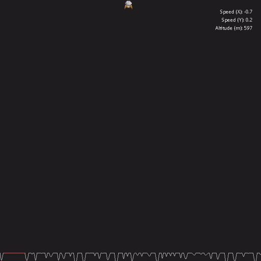

# CPPND: Capstone Lunar Lander Gamer

## The Game
This is a repo for the Capstone project in the [Udacity C++ Nanodegree Program](https://www.udacity.com/course/c-plus-plus-nanodegree--nd213). 
Which implements a version of the game genre: "Lunar Lander" where the mission of the player is to land the lander safely on the surface of the planet.

Safely landing means one have to pay attention to the X and Y velocities as well as the better landing location (marked in red).

Landing successfully means landing in the red zone at a safe speed (no horizontal speed and a slow vertical speed). If landed successfully the crew will de-board.
Landing unsuccessfully means you will see an explosion (we don't want to see an explosion).

Once you achieve one of those you have to re-start the game by closing and re-running the program.

## Structure & Functionality

### File Structure
The files have a simple structure, simply maintaining:
* the header files in the `include` folder
* the C++ files inside the `src` folder
* all the resources are located inside the `res` folder
  * `/res/fonts` contains the font files used for the rendering of the information of the lander
  * `/res/gfx` contains the PNG files used for the rendering of the lander, the crew and the explosion

### Class Structure
The Main class:
* The class is just used to load the necessary textures and start the game and run itself.

The Game class:
* contains an object for the lander, one for the crew and one for the explosion.
* it is responsible for the main loop as well as setting the landing platform
* it passes all the necessary information into the renderer

The Renderer class:
* the main render loop will clear the screen and clear it 
* it renders all of the entities we pass (the lander, the crew and the explosion)
* it also renders the HUD (heads up display) Info about the speed and altitude of the lander
* it renders the ground based on a Perlin Noise 1D algorithm

The Entity class:
* Takes care of holding the texture information as well as its size
* It also tracks the X and Y position of the texture
* if the texture is a sprite it can also be controlled by this class

The Controller class:
* Used to handle the input by the user

The Crew, Explosion and Lander classes:
* Are used to enrich the entity class with the necessary informations to the object itself

The Infotext class:
* It is similar to the Entity class but for rendering of text in the window

The NumberGenerator class:
* Used for all needs of Number generation that we need:
  * The perlin noise generation for the ground
  * The random floating number generation for the starting speed of the aircraft
  * The random integer number generation for the start of the landing platform

## Rubric Points addressed

### Loops, Functions, I/O
**The project demonstrates an understanding of C++ functions and control structures.**
I've used conditional structures to check if the landing is successful or not: (Game::Update lines 72 - 81)

There are loops used in order to render the entities (Renderer::Render lines 61 - 63) and the HUD (Renderer::RenderLanderInfo lines 102 - 114)

There is a loop (Controller::HandleInput lines 7 - 27) to check for the input of the user.

**The project reads data from a file and process the data, or the program writes data to a file.**
This project reads data from TTF files and PNG files by using the SDL2_TTF and SDL2_IMAGE libraries respectively.
See `main.cpp` lines 15-17 and `InfoText.hpp` line 19 for the usage of it. 

**The project accepts user input and processes the input.**
You can control the lander by the arrow keys, which are handled in the `controller` class (Controller::HandleInput lines 8 - 22)

### Object Oriented Programming
**The project uses Object Oriented Programming techniques.**
**Classes follow an appropriate inheritance hierarchy.**
The usage of the entity class and its descendants (Crew, Lander and Explosion) show the usage of Inheritance.
See `Crew::Crew`, `Lander::Lander` and `Explosion::Explosion` for examples of it.

**Classes use appropriate access specifiers for class members.**
All of the classes created encapsulate the fields that are private and expose the necessary ones through getters (such the X and Y from the Entity class)

**Class constructors utilize member initialization lists.**
All classes that inherit from the Entity class use initialization lists to pass the values to the parent class (see `Lander::Lander` lines 9-11) and initialize their private variables.

## Dependencies for Running Locally
* cmake >= 3.7
  * All OSes: [click here for installation instructions](https://cmake.org/install/)
* make >= 4.1 (Linux, Mac), 3.81 (Windows)
  * Linux: make is installed by default on most Linux distros
  * Mac: [install Xcode command line tools to get make](https://developer.apple.com/xcode/features/)
  * Windows: [Click here for installation instructions](http://gnuwin32.sourceforge.net/packages/make.htm)
* SDL2 >= 2.0
  * All installation instructions can be found [here](https://wiki.libsdl.org/Installation)
  >Note that for Linux, an `apt` or `apt-get` installation is preferred to building from source.
  > use `apt install libsdl2-dev` if in a debian based system (with apt)
* SDL2_image >= 2.0
  * Follow the same installation steps of the SDL2 library but use the following [link](https://www.libsdl.org/projects/SDL_image/)
  * This is needed for the rendering of the sprites in the application (Lander, Crew and Explosion)
  > use `apt install libsdl2-image-dev` if in a debian based system (with apt)
* SDL_ttf >= 2.0
  * Follow the same installation steps of the SDL2 library but use the following [link](https://www.libsdl.org/projects/SDL_ttf/)
  * This is needed for the rendering of the text (speed and position of lander)
  > use `apt install libsdl2-ttf-dev` if in a debian based system (with apt)
* gcc/g++ >= 5.4
  * Linux: gcc / g++ is installed by default on most Linux distros
  * Mac: same deal as make - [install Xcode command line tools](https://developer.apple.com/xcode/features/)
  * Windows: recommend using [MinGW](http://www.mingw.org/)

## Basic Build Instructions

1. Clone this repo.
2. Make a build directory in the top level directory: `mkdir build && cd build`
3. Compile: `cmake .. && make`
4. Run it: `./LanderGame`.

## CC Attribution-ShareAlike 4.0 International

Shield: [![CC BY-SA 4.0][cc-by-sa-shield]][cc-by-sa]

This work is licensed under a
[Creative Commons Attribution-ShareAlike 4.0 International License][cc-by-sa].

[![CC BY-SA 4.0][cc-by-sa-image]][cc-by-sa]

[cc-by-sa]: http://creativecommons.org/licenses/by-sa/4.0/
[cc-by-sa-image]: https://licensebuttons.net/l/by-sa/4.0/88x31.png
[cc-by-sa-shield]: https://img.shields.io/badge/License-CC%20BY--SA%204.0-lightgrey.svg
